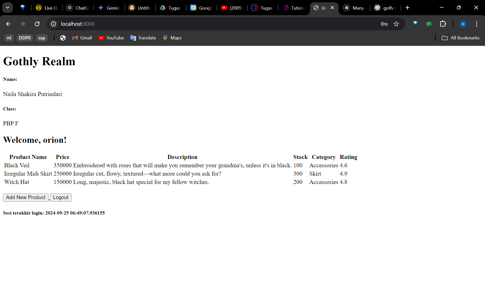
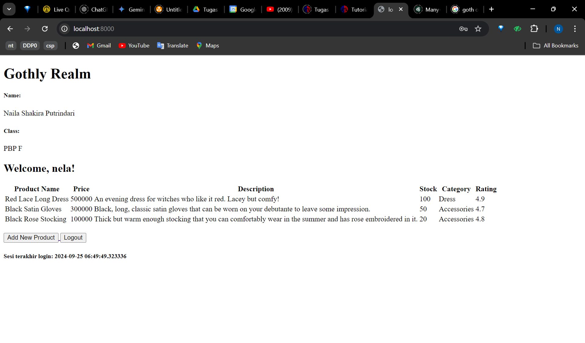

Berikut link aplikasi pws: http://naila-shakira-gothlyrealm.pbp.cs.ui.ac.id/

## Tugas 2
Berikut step-by-step pengimplementasian checklistnya:
1. Membuat direktori baru pada lokal dengan nama e-commerce
2. Menyalakan virtual environment
3. Membuat berkas (.txt) berisi dependencies yang akan di install pada direktori tersebut
4. Melakukan instalasi terhadap dependencies tersebut pada terminal
5. Membuat project baru bernama e_shop
6. Menambahkan host lokal pada ALLOWED_HOSTS di settings.py
7. Membuat repositori GitHub bernama e-commerce dan menginisiasi direktori lokal e-commerce sebagai repositori Git
8. Menambahkan berkas .gitignore lalu melakukan add, commit and push dari direktori lokal
9. Membuat aplikasi dengan nama "main" dan mendaftarkan "main" ke INSTALLED_APPS
10. Membuat direktori "template" dalam direktori "main"
11. Membuat berkas "main.html" dalam direktori templates yang berisi nama toko berserta nama dan kelas saya
12. Membuat model berisi atribut yang dibutuhkan serta menambahkan fungsi untuk validasi rating (maksimal 5.0)
13. Melakukan migrasi model
14. Menambahkan fungsi yang berisi data pada views.py 
15. Memodifikasi "main.html" hingga menampilkan data dari views
16. Membuat routing pada urls.py di aplikasi main
17. Menambahkan rute URL pada urls.py project untuk menghubungkannya ke tampilan main
18. Menjalankan project Django untuk melihat apakah aplikasi berjalan atau tidak
19. Melakukan add, commit push dari direktori lokal
20. Membuat project baru pada PWS lalu menambahkan url deployment pws pada allowed hosts
21. Melakukan add, commit, push dan menjalankan perintah pada project command sesuai di halaman pws
22. Mengubah kembali branch utama menjadi "main"

Bagan berisi request client ke web aplikasi berbasis Django beserta responnya (serta kaitannya antara urls.py, views.py, models.py dan berkas html):

                                                                                            database
                                                                                                ^
                                                                                                |
                                                                                                v
                                                                                            models.py
                                                                                                |
                                                                                            (read data)
                                                                                                |
                                                                                                v
User Request --(HTTP Request)--> browser --> urls.py --(Route to a certain view based on the request)--> views.py --(HTTP Response)--> browser --> User
                                                                                                ^
                                                                                                |
                                                                                            filename.html

*note = panah atas dan bawah mengarah pada views.py

Ada beberapa fungsi git dalam pengembangan perangkat lunak:
1. Memungkinkan untuk dapat berkolaborasi atau bekerja bersama pada proyek yang sama tanpa mengganggu pekerjaan satu sama lain
2. Git menyimpan salinan proyek hingga mudah untuk memulihkan versi sebelumnya jika terjadi kesalahan atau kehilangan data
3. Perubahan kode yang tercatat (commit messages) memungkinkan untuk dapat dengan cepat memperbarui kode di server

## Tugas 3

Django digunakan sebagai permulaan pembelajaran pengembangan perangkat lunak karena penggunaan MVT (Model View Template) yang memisahkan logika aplikasi, tampilan dan struktur data. Hal ini membuat lebih mudah untuk memelihara kode dan project menjadi lebih efektif dan efisien. 

Model pada Django disebut sebagai ORM (Object-Relational Mapping) karena berperan sebagai perantara antara kode Python (object) dan tabel dalam database relational. ORM memungkinkan untuk berinteraksi dengan database tanpa harus menulis SQL secara langsung. 

Jelaskan mengapa kita memerlukan data delivery dalam pengimplementasian sebuah platform?
    Data delivery dibutuhkan untuk mengimplementasikan sebuah platform karena merupakan proses penyampaian sata antara berbagai komponen atau sistem dalam platform tersebut. Hal ini sangat krusial karena dalam pembuatan sebuah platform dibutuhkan  pengiriman data yang cepat, tepat dan aman.

Menurutmu, mana yang lebih baik antara XML dan JSON? Mengapa JSON lebih populer dibandingkan XML?
    JSON lebih populer dibandingkan XML karena sintaks JSON berasal dari objek JavaScript hingga banyak bahasa pemrograman yang memiliki dukungan untuk membaca dan membuat JSON. JSON juga memiliki format yang mudah dimengerti karena tiap elemennya self describing dan JSON lebih ringkas hingga dapat lebih efisien. Aku lebih memilih JSON karena lebih readable.

Jelaskan fungsi dari method is_valid() pada form Django dan mengapa kita membutuhkan method tersebut?
    Method is_valid() pada form Django digunakan untuk melakukan validasi data yang diinput pada suatu form. Jadi program akan memeriksa apakah tipe data sesuai dengan yang ditentukan. Jika tidak, program akan menampilkan pesan error. Method ini dibutuhkan untuk memastikan data yang diinput sesuai sebelum data tersebut disimpan/diproses hingga akan mencegah error dimasa depan.

Mengapa kita membutuhkan csrf_token saat membuat form di Django? Apa yang dapat terjadi jika kita tidak menambahkan csrf_token pada form Django? Bagaimana hal tersebut dapat dimanfaatkan oleh penyerang?
    Kita membutuhkan csrf_token saat membuat form di Django untuk mencegah serangan berbahaya. Django akan secara otomatis menghasilkan token ini untuk setiap form hingga program dapat memverifikasi token ini untuk memastikan bahwa permintaan berasal dari sumber yang sah hingga tidak akan membuka celah bagi penyerang untuk membuat permintaan palsu atau membuat suatu perubahan.

Berikut adalah cara saya mengimplementasikan checklist pada Tugas 2 ini:
1. Membuat direktori templates pada direktori utama dan menambahkan file base.html sebagai kerangka umum.
2. Mengubah settings.py pada direktori proyek hingga dapat mendeteksi base.html sebagai berkas template.
3. Mengedit kode pada main.html agar memakai base.html sebagai templatenya.
4. Mengubah primary key menjadi menggunakan UUID dengan menambahkan variable id pada models.py
5. Melakukan migrasi model.
6. Membuat berkas forms.py pada direktori main yang akan menerima data produk baru.
7. Menambahkan import yang dibutuhkan dan membuat fungsi yang menambahkan data produk baru ketika data selesai disubmit pada berkas views.py.
8. Menambahkan variable yang mengambil semua object product.
9. Menambahkan import dan path url untuk add_product di urls.py.
10. Membuat berkas add_product.py dalam direktori main/templates dimana akan dibuat button untuk menampilkan view add_product.
11. Menambahkan kode pada main.html yang akan menampilkan data product dalam bentuk tabel dan tombol untuk menambah produk yang akan mengarahkan ke halaman form.
12. Menambahkan import HttpResponse dan Serializer pada views.py dalam main.
13. Membuat function yang menyimpan hasil query seluruh data pada product dan return  HttpResponse yang berisi parameter data hasil query yang sudah diserialisasi menjadi xml/json pada views.py pada direktori main.
14. Membuat fungsi pada views.py dalam main yang menerima parameter request dan id dimana fungsi tersebut berisi variable yang menyimpan hasil query data dengan id tertentu lalu return HttpResponse yang berisi parameter data hasil query yang sudah diserialisasi menjadi xml/json.
15. Import fungsi yang telah dibuat pada urls.py di direktori main, lalu tambahkan path url ke dalam urlpatterns yang akan mengakses fungsi yang diimpor tersebut.

Mengakses keempat URL di poin 2 menggunakan Postman, membuat screenshot dari hasil akses URL pada Postman, dan menambahkannya ke dalam README.md.
1. XML

2. JSON

3. XML by ID

4. JSON by ID

## Tugas 4

Apa perbedaan antara HttpResponseRedirect() dan redirect()?
    HttpResponseRedirect() dapat mengatur status HTTP, konten respons dan lainnya hingga biasanya digunakan saat memerlukan kustomisasi spesifik. redirect() sudah secara otomatis mengatur status HTTP yang sesuai dan merupakan suatu shortcut yang lebih user-friendly dibanding fungsi sebelumnya.

Jelaskan cara kerja penghubungan model Product dengan User!
    Menghubungkan model Product dengan User ini dicapai dengan membuat suatu relasi antara produk yang disimpan dalam database dengan pengguna yang telah terdaftar. Program juga menghubungkan model tersebut menggunakan ForeignKey dan dipastikan tiap produk berhubungan dengan suatu akun.

Apa perbedaan antara authentication dan authorization, apakah yang dilakukan saat pengguna login? Jelaskan bagaimana Django mengimplementasikan kedua konsep tersebut.
    Autentikasi merupakan proses verifikasi identitas pengguna dimana program memastikan bahwa pengguna yang mencoba masuk ke dalam sistem adalah pengguna yang sah. Sedangkan authorized untuk nentuin apa yang diizinkan dan tidak bagi pengguna yang telah diverifikasi.

Bagaimana Django mengingat pengguna yang telah login? Jelaskan kegunaan lain dari cookies dan apakah semua cookies aman digunakan?
    Django selalu menyimpan informasi seseorang yang sedang masuk. Cookie dapat dimanfaatkan sebagai arana dalam menyimpan referensi pengguna dan tidak semua cookie aman untuk digunakan.

Jelaskan bagaimana cara kamu mengimplementasikan checklist di atas secara step-by-step (bukan hanya sekadar mengikuti tutorial).

- Mengimplementasikan fungsi registrasi, login, dan logout untuk memungkinkan pengguna untuk mengakses aplikasi sebelumnya dengan lancar.
1. Import UserCreationForm dan messages pada views.py di main untuk pendaftaran pengguna.
2. Menambahkan fungsi register yang akan membuat akun pengguna saat user submit form.
3. Membuat register.html pada main/templates untuk membuat tampilan halaman register.
4. Import function dan masukkan path url register ke urlpatterns di urls.py.
5. Import authenticate, login dan AuthenticationForm di views.py untuk melakukan autentikasi dan login.
6. Menambahkan fungsi login_user untuk mengautentikasi pengguna yang merequest masuk.
7. Membuat login.html pada main/templates untuk membuat tampilan halaman login.
8. Import function dan masukkan path url login ke urlpatterns di urls.py.
9. Import logout di views.py lalu menambahkan fungsi logout_user.
10. Menambahkan button logout dipaling bawah pada main.html.
11. Import function dan masukkan path url logout ke urlpatterns di urls.py.
12. Import login_required pada views.py dan menambahkan dekorator tersebut diatas fungsi show_main agar hanya pengguna yang sudah diautentikasi/login saja yang bisa akses.

- Menampilkan detail informasi pengguna yang sedang logged in seperti username dan menerapkan cookies seperti last login pada halaman utama aplikasi.
1. Import HttpResponseRedirect, reverse dan datetime di views.py.
2. Mengubah kode pada function login_user dimana saat form valid akan membuat cookie untuk last_login.
3. Menambahkan context pada show_main yaitu last_login.
4. Tambahkan delete cookie last_login pada fungsi logout_user.
5. Menambahkan kata sapaan terhadap username yang sedang login dan data last_login pada main.html.

- Menghubungkan model Product dengan User.
1. Import User pada models.py lalu inisialisasi user pada Product menggunakan ForeignKey yang akan menghubungkan tiap produk dengan suatu user.
2. Mengubah function add_product pada views.py agar tidak langsung menyimpan objek ke database, jadi harus diinisialisasi kepemilikan dulu.
3. Mengubah value products pada fungsi show_main menjadi filter sesuai dengan user sekarang.
4. Melakukan migrasi model dan menetapkan isi produk sekarang dimiliki oleh user ID 1.
5. Tambahkan import os dan menambahkan mengenai production dan debug di berkas settings.py.

- Membuat dua akun pengguna dengan masing-masing tiga dummy data menggunakan model yang telah dibuat pada aplikasi sebelumnya untuk setiap akun di lokal.
1. Menyalakan virtual environment lalu masuk ke halaman web.
2. Membuat akun baru dengan klik "Register Now".
3. Mengisi semua field sesuai dengan ketentuan.
4. Login pada akun yang telah dibuat.
5. Menambahkan produk baru dengan klik button "Add New Product" dan mengisi semua field lalu submit formnya.
6. Lakukan penambahan produk hingga terdapat tiga produk pada tabel lalu klik button "Logout" untuk keluar.
7. Ulangi keseluruhan langkah sekali lagi.
Akun 1: 
Akun 2: 

# Tugas 5

Jika terdapat beberapa CSS selector untuk suatu elemen HTML, jelaskan urutan prioritas pengambilan CSS selector tersebut!
1. !important rules
    Tag !important akan menimpa rule lain karena merupakan prioritas tertinggi.
2. Inline Styles
3. ID
4. Clases, pseudo-classes, attribute selectors
5. Elements and pseudo-elements
6. Urutan dalam CSS Stylesheet
    Jika ada dua CSS rule yang didefinisikan dengan prioritas yang sama maka CSS rule yang diaplikasikan adalah yang terakhir didefinisikan.

Mengapa responsive design menjadi konsep yang penting dalam pengembangan aplikasi web? Berikan contoh aplikasi yang sudah dan belum menerapkan responsive design!
    Responsive design merupakan konsep yang sangat penting dalam pengembangan aplikasi web karena konsep ini memastikan bahwa suatu aplikasi dapat beradaptasi sesuai dengan perangkat dan ukuran layar yang user gunakan untuk mengakses aplikasi tersebut. Hal ini membuat pengalaman pengguna akan menjadi lebih optimal.

Jelaskan perbedaan antara margin, border, dan padding, serta cara untuk mengimplementasikan ketiga hal tersebut!
- Margin memberi jarak antara elemen (seperti box) dengan elemen lain di sekitarnya. Margin tidak termasuk dalam ukuran elemen itu. Cara implementasi:
.box {
  margin-top: 5px;
  margin-right: 5px;
  margin-buttom: 5px;
  margin-left: 5px;
}
- Border merupakan garis yang mengelilingi elemen setelah padding dan sebelum margin. Border seperti memberi bingkai pada elemen. Cara implementasi:
.box{
  border: 5px dashed blue;
}
- Padding memberi jarak antara konten/teks dengan bordernya. Cara implementasi:
.box{
  padding: 3px 5px;
}

Jelaskan konsep flex box dan grid layout beserta kegunaannya!
- Flexbox mengatur elemen pada sumbu tunggal yaitu horizontal atau vertikal. hal ini dapat mempermudah dalam penyusunan elemen yang lebih fleksibel dalam satu baris atau kolom dimana elemen2 dapat secara otomatis menyesuaikan ukuran dan jarak antar elemen.
- Grid Layout mengatur tata letak secara dua dimensi hingga dapat mengatur secara horizontal dan vertikal. Hal ini membuat pengaturan lebih kompleks hingga dapat menempatkan elemen dengan lebih spesifik.

Jelaskan bagaimana cara kamu mengimplementasikan checklist di atas secara step-by-step (bukan hanya sekadar mengikuti tutorial)!
- Implementasi fungsi untuk menghapus dan mengedit product.
1. Import reverse dan HttpResponseRedirect
2. Membuat fungsi edit_produk pada views.py 
3. Membuat edit_product.html 
4. Import edit_product di urls.py lalu tambahkan path urlnya ke urlpatterns
5. Menambahkan button edit produk pada tabel di main.html
6. Membuat fungsi delete_product pada views.py
7. Import delete_product tersebut di urls.py lalu menambahkan path urlnya ke urlspatterns
8. Menambahkan button delete_product pada tabel di main.html

- Kustomisasi halaman login, register, dan tambah product semenarik mungkin.
1. Menambah tailwind ke aplikasi di base.html
2. Menambahkan middleware WhiteNoise pada settings.py
3. Mengkonfigurasi static root, staticfiles dirs. dan static url pada settings.py
4. Membuat file static/css lalu menambahkan file global.css
5. Mengisi file global.css dengan style css yang akan diimplementasikan di penjuru aplikasi
6. Menghubungkan global.css dan tailwind ke base.html
7. Menambahkan styling css pada tiap halaman login, register dan add_product

- Kustomisasi halaman daftar product menjadi lebih menarik dan responsive.
- Untuk setiap card product, buatlah dua buah button untuk mengedit dan menghapus product pada card tersebut!
1. Membuat file product_card untuk menampilkan daftar product
2. Membuat direktori image dalam static dan menaruh gambar yang dibutuhkan (skull untuk menyampaikan tidak ada produk saat ini dan bintang2 untuk rating)
3. Isi product_card dengan logika dan styling css lalu menambahkan button edit dan delete product pada masing2 card product 

- Buatlah navigation bar (navbar) untuk fitur-fitur pada aplikasi yang responsive terhadap perbedaan ukuran device, khususnya mobile dan desktop.
1. Membuat berkas navbar.html 
2. Memodifikasi navbar berdasarkan template dari asdos dan template dari google
3. Menambahkan navbar pada main.html, add_product.html dan edit_product.html

# Tugas 6
Jelaskan manfaat dari penggunaan JavaScript dalam pengembangan aplikasi web!
    JavaScript dapat memungkinkan aplikasi menjadi lebih interaktif, dinamis dan responsif. JavaScript memungkinkan developer untuk mengubah tampilan dan fungsi dari elemen HTML secara langsung, dapat berjalan di berbagai platform dan perangkat, elemen UI menjadi lebih interaktif dan penggunaan AJAX. JavaScript juga berjalan pada browser user hingga memungkinkan manipulasi DOM secara langsung dan cepat (aplikasi dapat merespons tindakan user secara instan) yang dapat mengurangi beban server.

Jelaskan fungsi dari penggunaan await ketika kita menggunakan fetch()! Apa yang akan terjadi jika kita tidak menggunakan await?
    Penggunaan await saat menggunaan fetch() adalah untuk menunggu hingga permintaan HTTP yang dijalankan fetch() selesai dan nilainya tersedia, baru kemudian akan melanjutkan mengeksekusi baris kode berikutnya. Jika tidak menggunakan await, fetch() akan segera mengembalikan nilai tanpa menunggu permintaan HTTP selesai hingga nilai tersebut bukanlah data yang sebenarnya. Hal ini berarti kode akan melanjutkan eksekusi ke baris kode selanjutnya sebelum hasil permintaan sebenarnya tersedia, yang dapat menyebabkan masalah saat mencoba mengakses data tersebut.

Mengapa kita perlu menggunakan decorator csrf_exempt pada view yang akan digunakan untuk AJAX POST?
    Dekorator csrf_exempt digunakan pada view untuk AJAX POST karena Django secara default menerapkan CSRF protection dimana CSRF (Cross-Site Request Forgery) adalah serangan dimana penyerang akan mengelabui user agar mengirimkan permintaan yang tidak sah ke server atas nama mereka. Untuk AJAX POST, perlu dilakukan pengecualian perlindungan CSRF karena permintaan POST mungkin akan ditolak oleh server karena tidak menyertakan token CSRF yang valid.

Pada tutorial PBP minggu ini, pembersihan data input pengguna dilakukan di belakang (backend) juga. Mengapa hal tersebut tidak dilakukan di frontend saja?
    Pembersihan data input pengguna tidak hanya dilakukan di frontend, tapi juga di backend karena alasan keamanan. Hal ini dikarenakan kita dapat menvalidasi bahwa semua data yang masuk ke sistem sudah sesuai. Pembersihan di backend juga dapat mencegah potensi serangan yang dapat terjadi jika data dibersihkan di luar.

Jelaskan bagaimana cara kamu mengimplementasikan checklist di atas secara step-by-step (bukan hanya sekadar mengikuti tutorial)!

PENGGUNAAN AJAX GET POST
1. Import csrf_exempt dan require_POST lalu buat fungsi add_product_ajax yang akan menambahkan produk dengan AJAX serta fungsi tersebut dibatasi oleh decorators yang baru pada views.py
2. Import fungsi tadi dan menambahkan pathnya ke url patterns di urls.py
3. Menambahkan filter pada fungsi show_json dan show_xml pada views.py
4. Menghapus blok kode conditionals untuk menampilkan product di main.html
5. Menambah blok kode script yang berisi fungsi getProduct yang akan mengambil produk dengan json dan fungsi refreshProduct yang akan merefresh data secara asinkronus dimana berisi kode dari product card
6. Membuat modal untuk add product dengan AJAX
7. Menambahkan fungsi JavaScript seperti showModal dan hideModal agar modal dapat berfungsi
8. Menambahkan button Add Product dengan AJAX
9. Membuat fungsi addProduct pada script dan berikan event listener
10. Menambahkan strip tags untuk membersihkan data baru pada data non-number di fungsi add_product_ajax (views.py)
11. Menambahkan method clean dari tiap2 data pada class ProductForm di forms.py
12. Menambahkan blok kode DOMPurify di block meta pada main.html
13. Menambahkan kode sanitize dari tiap2 data pada refreshProducts