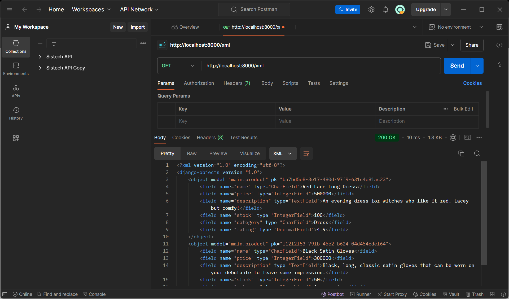
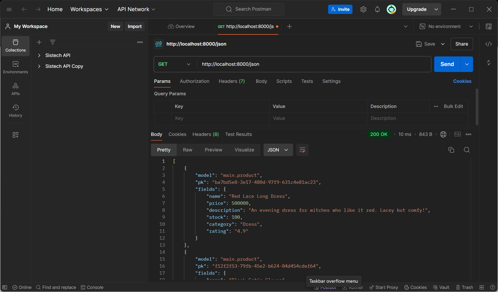
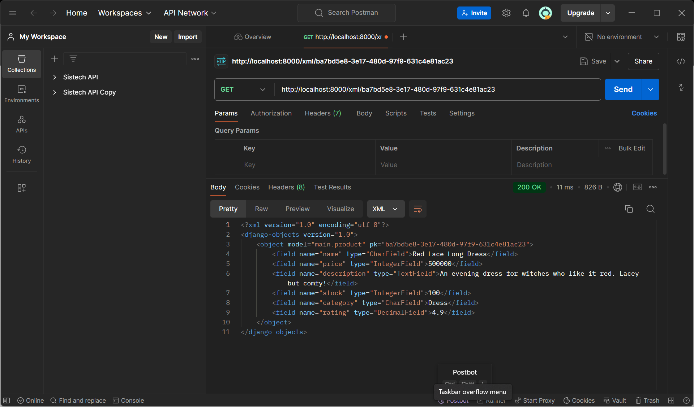
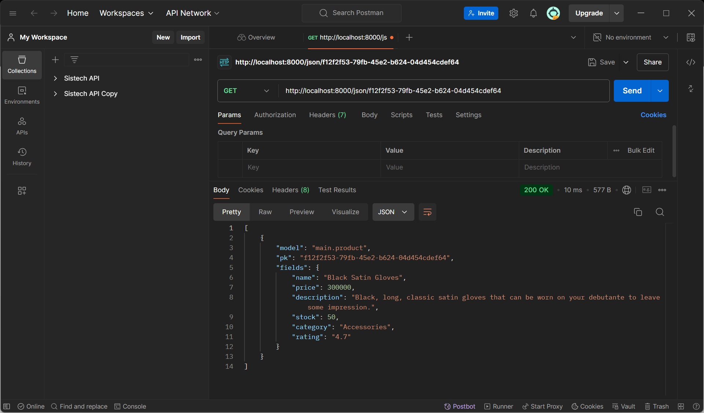

Berikut link aplikasi pws: http://naila-shakira-eshop.pbp.cs.ui.ac.id/ (belum update, masih error)

Berikut step-by-step pengimplementasian checklistnya:
1. Membuat direktori baru pada lokal dengan nama e-commerce
2. Menyalakan virtual environment
3. Membuat berkas (.txt) berisi dependencies yang akan di install pada direktori tersebut
4. Melakukan instalasi terhadap dependencies tersebut pada terminal
5. Membuat project baru bernama e_shop
6. Menambahkan host lokal pada ALLOWED_HOSTS di settings.py
7. Membuat repositori GitHub bernama e-commerce dan menginisiasi direktori lokal e-commerce sebagai repositori Git
8. Menambahkan berkas .gitignore lalu melakukan add, commit and push dari direktori lokal
9. Membuat aplikasi dengan nama "main" dan mendaftarkan "main" ke INSTALLED_APPS
10. Membuat direktori "template" dalam direktori "main"
11. Membuat berkas "main.html" dalam direktori templates yang berisi nama toko berserta nama dan kelas saya
12. Membuat model berisi atribut yang dibutuhkan serta menambahkan fungsi untuk validasi rating (maksimal 5.0)
13. Melakukan migrasi model
14. Menambahkan fungsi yang berisi data pada views.py 
15. Memodifikasi "main.html" hingga menampilkan data dari views
16. Membuat routing pada urls.py di aplikasi main
17. Menambahkan rute URL pada urls.py project untuk menghubungkannya ke tampilan main
18. Menjalankan project Django untuk melihat apakah aplikasi berjalan atau tidak
19. Melakukan add, commit push dari direktori lokal
20. Membuat project baru pada PWS lalu menambahkan url deployment pws pada allowed hosts
21. Melakukan add, commit, push dan menjalankan perintah pada project command sesuai di halaman pws
22. Mengubah kembali branch utama menjadi "main"

Bagan berisi request client ke web aplikasi berbasis Django beserta responnya (serta kaitannya antara urls.py, views.py, models.py dan berkas html):

                                                                                            database
                                                                                                ^
                                                                                                |
                                                                                                v
                                                                                            models.py
                                                                                                |
                                                                                            (read data)
                                                                                                |
                                                                                                v
User Request --(HTTP Request)--> browser --> urls.py --(Route to a certain view based on the request)--> views.py --(HTTP Response)--> browser --> User
                                                                                                ^
                                                                                                |
                                                                                            filename.html

*note = panah atas dan bawah mengarah pada views.py

Ada beberapa fungsi git dalam pengembangan perangkat lunak:
1. Memungkinkan untuk dapat berkolaborasi atau bekerja bersama pada proyek yang sama tanpa mengganggu pekerjaan satu sama lain
2. Git menyimpan salinan proyek hingga mudah untuk memulihkan versi sebelumnya jika terjadi kesalahan atau kehilangan data
3. Perubahan kode yang tercatat (commit messages) memungkinkan untuk dapat dengan cepat memperbarui kode di server

Django digunakan sebagai permulaan pembelajaran pengembangan perangkat lunak karena penggunaan MVT (Model View Template) yang memisahkan logika aplikasi, tampilan dan struktur data. Hal ini membuat lebih mudah untuk memelihara kode dan project menjadi lebih efektif dan efisien. 

Model pada Django disebut sebagai ORM (Object-Relational Mapping) karena berperan sebagai perantara antara kode Python (object) dan tabel dalam database relational. ORM memungkinkan untuk berinteraksi dengan database tanpa harus menulis SQL secara langsung. 

Jelaskan mengapa kita memerlukan data delivery dalam pengimplementasian sebuah platform?
    Data delivery dibutuhkan untuk mengimplementasikan sebuah platform karena merupakan proses penyampaian sata antara berbagai komponen atau sistem dalam platform tersebut. Hal ini sangat krusial karena dalam pembuatan sebuah platform dibutuhkan  pengiriman data yang cepat, tepat dan aman.

Menurutmu, mana yang lebih baik antara XML dan JSON? Mengapa JSON lebih populer dibandingkan XML?
    JSON lebih populer dibandingkan XML karena sintaks JSON berasal dari objek JavaScript hingga banyak bahasa pemrograman yang memiliki dukungan untuk membaca dan membuat JSON. JSON juga memiliki format yang mudah dimengerti karena tiap elemennya self describing dan JSON lebih ringkas hingga dapat lebih efisien. Aku lebih memilih JSON karena lebih readable.

Jelaskan fungsi dari method is_valid() pada form Django dan mengapa kita membutuhkan method tersebut?
    Method is_valid() pada form Django digunakan untuk melakukan validasi data yang diinput pada suatu form. Jadi program akan memeriksa apakah tipe data sesuai dengan yang ditentukan. Jika tidak, program akan menampilkan pesan error. Method ini dibutuhkan untuk memastikan data yang diinput sesuai sebelum data tersebut disimpan/diproses hingga akan mencegah error dimasa depan.

Mengapa kita membutuhkan csrf_token saat membuat form di Django? Apa yang dapat terjadi jika kita tidak menambahkan csrf_token pada form Django? Bagaimana hal tersebut dapat dimanfaatkan oleh penyerang?
    Kita membutuhkan csrf_token saat membuat form di Django untuk mencegah serangan berbahaya. Django akan secara otomatis menghasilkan token ini untuk setiap form hingga program dapat memverifikasi token ini untuk memastikan bahwa permintaan berasal dari sumber yang sah hingga tidak akan membuka celah bagi penyerang untuk membuat permintaan palsu atau membuat suatu perubahan.

Berikut adalah cara saya mengimplementasikan checklist pada Tugas 2 ini:
1. Membuat direktori templates pada direktori utama dan menambahkan file base.html sebagai kerangka umum.
2. Mengubah settings.py pada direktori proyek hingga dapat mendeteksi base.html sebagai berkas template.
3. Mengedit kode pada main.html agar memakai base.html sebagai templatenya.
4. Mengubah primary key menjadi menggunakan UUID dengan menambahkan variable id pada models.py
5. Melakukan migrasi model.
6. Membuat berkas forms.py pada direktori main yang akan menerima data produk baru.
7. Menambahkan import yang dibutuhkan dan membuat fungsi yang menambahkan data produk baru ketika data selesai disubmit pada berkas views.py.
8. Menambahkan variable yang mengambil semua object product.
9. Menambahkan import dan path url untuk add_product di urls.py.
10. Membuat berkas add_product.py dalam direktori main/templates dimana akan dibuat button untuk menampilkan view add_product.
11. Menambahkan kode pada main.html yang akan menampilkan data product dalam bentuk tabel dan tombol untuk menambah produk yang akan mengarahkan ke halaman form.
12. Menambahkan import HttpResponse dan Serializer pada views.py dalam main.
13. Membuat function yang menyimpan hasil query seluruh data pada product dan return  HttpResponse yang berisi parameter data hasil query yang sudah diserialisasi menjadi xml/json pada views.py pada direktori main.
14. Membuat fungsi pada views.py dalam main yang menerima parameter request dan id dimana fungsi tersebut berisi variable yang menyimpan hasil query data dengan id tertentu lalu return HttpResponse yang berisi parameter data hasil query yang sudah diserialisasi menjadi xml/json.
15. Import fungsi yang telah dibuat pada urls.py di direktori main, lalu tambahkan path url ke dalam urlpatterns yang akan mengakses fungsi yang diimpor tersebut.

Mengakses keempat URL di poin 2 menggunakan Postman, membuat screenshot dari hasil akses URL pada Postman, dan menambahkannya ke dalam README.md.
1. XML

2. JSON

3. XML by ID

4. JSON by ID
